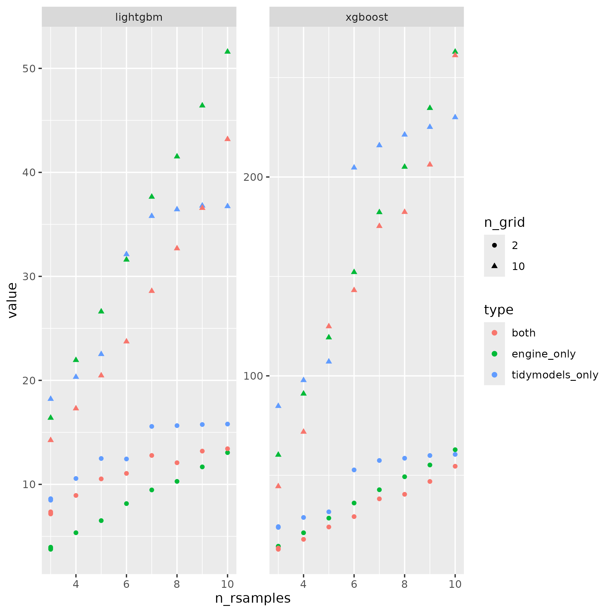

README
================
2024-05-16

- The run-tidymodels-parallel.sh file is a shell script used to run the
  R script with multiple parameters.
- The tidymodels-parallel.R file is a R script to run the benchmarking
  according to number of resamples and number of options in the grid.
- Here the results: 
