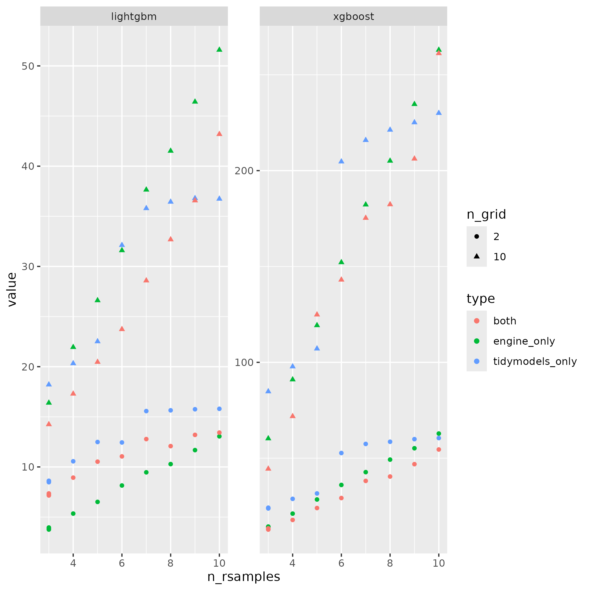

```{r setup, include=FALSE}
knitr::opts_chunk$set(echo = TRUE)
suppressPackageStartupMessages({
    library(tidyverse)
    library(tidymodels)
    library(bonsai)
    library(future)
    library(lightgbm)
    library(xgboost)
    pdf(NULL)
})

results <- list.files(pattern = "results_") |> 
    map(\(x){
        read_rds(x)
    }) |> 
    list_rbind() |> 
    pivot_longer(cols = c(xgboost, lightgbm), names_to = "engine") |> 
    separate_wider_delim(
        approach, delim = "_", names = c("time", "type"),
        too_many = "merge"
    ) |> 
    glimpse()

p <- results |> 
    filter(time == "elapsed") |> 
    mutate(n_grid = factor(n_grid)) |> 
    ggplot(aes(n_rsamples, value, colour = type, shape = n_grid)) +
    geom_point() +
    facet_wrap(~ engine, scales = "free")

print(p)

ggsave("results.png")
```

-  The run-tidymodels-parallel.sh file is a shell script used to  run the R script with multiple parameters.
-  The tidymodels-parallel.R file is a R script to run the benchmarking according to number of resamples and number of options in the grid.
- The tidymodels-parallel-collect.R file is the script to collect the results and make the final plot. Here the results:


